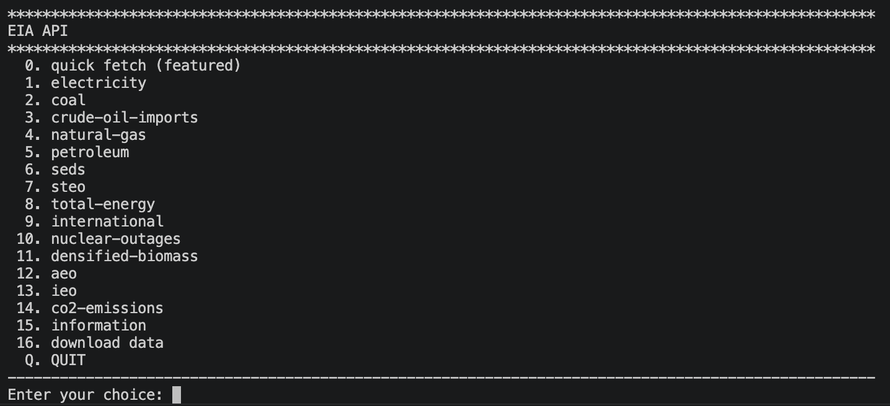

# EIA API App

## Overview

The **EIA API App** is a Python library that provides access to the Energy Information Administration (EIA) API<sup>1</sup>. You need to have an API key to use the EIA API.

## UI




## Description

A Python CLI app for interacting with the EIA API. It provides a command-line interface for exploring and querying energy data.

## Installation

Install all the required packages:

```bash
pip install -r requirements.txt
```

Copy the `.env.example` file to `.env` and add your API key.

```bashbash
cp .env.example .env
```

## Usage

Run the app:

```bash
python app/eia_app.py
```

## Disclaimer

This project is not affiliated with the Energy Information Administration (EIA) and is not endorsed by EIA.

According to EIA:

> The information submitted by reporting entities is preliminary data and is made available "as-is" by EIA. Neither EIA nor reporting entities are responsible for reliance on the data for any specific use.<sup>2</sup>

## License

GNU GPLv3.

Copyright (c) 2024 jouniverse

<sup>1</sup> [The EIA API is a free and open-source API that provides access to energy data from the U.S. Energy Information Administration (EIA)](https://www.eia.gov/opendata/index.php)

<sup>2</sup> [Hourly Electric Grid Monitor](https://www.eia.gov/electricity/gridmonitor/dashboard/electric_overview/US48/US48)
